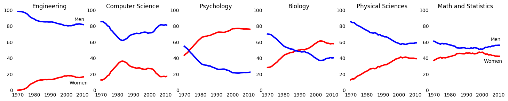

## Clean up the chart
1. Let's explore the gender gap in STEM fields, such as science, technology, engineering, and mathematics.
2. First off, start with the historical percentage of Biology degrees for both genders.


```python
import pandas as pd
import matplotlib.pyplot as plt
#Read data
women_degrees = pd.read_csv('percent-bachelors-degrees-women-usa.csv')
#Visualize the gender gap of Biology degree
fig, ax = plt.subplots()
ax.plot(women_degrees['Year'], women_degrees['Biology'], c='red', label='Women')
ax.plot(women_degrees['Year'], 100-women_degrees['Biology'], c='blue', label='Men')
#Disable tick marks
ax.tick_params(bottom="off", top="off", left="off", right="off")
#Erase spines
for key,spine in ax.spines.items():
    spine.set_visible(False)
#Display the chart
ax.legend(loc='upper right')
plt.show()
```


## Compare across STEMs
1. Let's compare gender gaps across 6 degrees.
2. Clean the chart by removing ticks, setting line width, improving the lay out and ordering, and replacing the legend with annotations.


```python
stem = ['Engineering', 'Computer Science', 'Psychology', 'Biology', 'Physical Sciences', 'Math and Statistics']
fig = plt.figure(figsize=(18, 3))
for sp in range(0,6):
    ax = fig.add_subplot(1,6,sp+1)
    ax.plot(women_degrees['Year'], women_degrees[stem[sp]], c='red', label='Women', linewidth=3)
    ax.plot(women_degrees['Year'], 100-women_degrees[stem[sp]], c='blue', label='Men', linewidth=3)
    #Set spines
    for key,spine in ax.spines.items():
        spine.set_visible(False)
    ax.set_xlim(1968, 2011)
    ax.set_ylim(0,100)
    ax.set_title(stem[sp])
    ax.tick_params(bottom="off", top="off", left="off", right="off")
    # Set text annotations 
    if sp == 0:
        ax.text(2005, 87, 'Men')
        ax.text(2002, 8, 'Women')
    elif sp == 5:
        ax.text(2005, 62, 'Men')
        ax.text(2001, 35, 'Women')
plt.show()
```





Findings: 
1. Degrees where women dominate are psychology.
2. Degrees where men dominate are Engineering, CS, Physical Sciences, Math and Statistics.
3. Big gaps in gender are Engineering, CS, Psychology.
4. Gender gaps are decreasing are Biology and Physial Sciences.
5. Math and Statistics are balanced.

## Comparison of all degrees
1. Let's visualize the gender gaps for all 17 degrees.


```python
#Hide x-axis labels, set y-axis labels, and add a horizontal line
stem = ['Psychology', 'Biology', 'Math and Statistics', 'Physical Sciences', 'Computer Science', 'Engineering', 'Computer Science']
liberal = ['Foreign Languages', 'English', 'Communications and Journalism', 'Art and Performance', 'Social Sciences and History']
others = ['Health Professions', 'Public Administration', 'Education', 'Agriculture','Business', 'Architecture']
fig = plt.figure(figsize=(16, 16))

## Generate first column of line charts, STEMs.
for sp in range(0,18,3):
    degree_index = int(sp/3)
    ax = fig.add_subplot(6,3,sp+1)
    ax.plot(women_degrees['Year'], women_degrees[stem[degree_index]], c='red', label='Women', linewidth=3)
    ax.plot(women_degrees['Year'], 100-women_degrees[stem[degree_index]], c='blue', label='Men', linewidth=3)
    for key,spine in ax.spines.items():
        spine.set_visible(False)
    ax.set_xlim(1968, 2011)
    ax.set_ylim(0,100)
    ax.set_title(stem[degree_index])
    ax.tick_params(bottom="off", top="off", left="off", right="off", labelbottom='off')
    ax.set_yticks([0,100])
    #Add a color to the horizontal line
    #Use 'alpha' parameter for the transparency
    ax.axhline(50, c=(171/255, 171/255, 171/255), alpha=0.3)
    
    if degree_index == 0:
        ax.text(2003, 85, 'Women')
        ax.text(2005, 10, 'Men')
    elif degree_index == 5:
        ax.text(2005, 87, 'Men')
        ax.text(2003, 7, 'Women')
        ax.tick_params(labelbottom='on')

## Generate second column of line charts, liberal arts.
for sp in range(1,16,3):
    degree_index = int((sp-1)/3)
    ax = fig.add_subplot(6,3,sp+1)
    ax.plot(women_degrees['Year'], women_degrees[liberal[degree_index]], c='red', label='Women', linewidth=3)
    ax.plot(women_degrees['Year'], 100-women_degrees[liberal[degree_index]], c='blue', label='Men', linewidth=3)
    for key,spine in ax.spines.items():
        spine.set_visible(False)
    ax.set_xlim(1968, 2011)
    ax.set_ylim(0,100)
    ax.set_title(liberal[degree_index])
    ax.tick_params(bottom="off", top="off", left="off", right="off", labelbottom='off')
    ax.set_yticks([0,100])
    ax.axhline(50, c=(171/255, 171/255, 171/255), alpha=0.3)
    
    if degree_index == 0:
        ax.text(2003, 78, 'Women')
        ax.text(2005, 18, 'Men')
    elif degree_index == 4:
        ax.tick_params(labelbottom='on')

## Generate third column of line charts, other degrees.
for sp in range(2,20,3):
    degree_index = int((sp-2)/3)
    ax = fig.add_subplot(6,3,sp+1)
    ax.plot(women_degrees['Year'], women_degrees[others[degree_index]], c='red', label='Women', linewidth=3)
    ax.plot(women_degrees['Year'], 100-women_degrees[others[degree_index]], c='blue', label='Men', linewidth=3)
    for key,spine in ax.spines.items():
        spine.set_visible(False)
    ax.set_xlim(1968, 2011)
    ax.set_ylim(0,100)
    ax.set_title(others[degree_index])
    ax.tick_params(bottom="off", top="off", left="off", right="off", labelbottom='off')
    ax.set_yticks([0,100])
    ax.axhline(50, c=(171/255, 171/255, 171/255), alpha=0.3)
    
    if degree_index == 0:
        ax.text(2003, 90, 'Women')
        ax.text(2005, 5, 'Men')
    elif degree_index == 5:
        ax.text(2005, 62, 'Men')
        ax.text(2003, 30, 'Women')
        ax.tick_params(labelbottom='on')
        
plt.show()
```


Findings: 
1. Degrees that men dominated are Engineering, CS, Physical Sciences, Architecture (3/4 from STEMs).
2. Degrees that women dominated are Biology, Psychology, Foreign Languages, Health Professions, English, Public Administration, Eduation, Communications and Journalism, Art and performance. 
3. Degrees that showed balanced gap (almost no gap) are Social Sciences and History, Business, Agriculture, Math and Statistics.    
